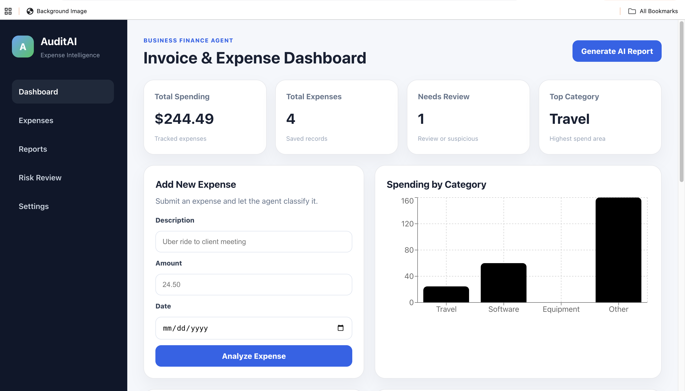
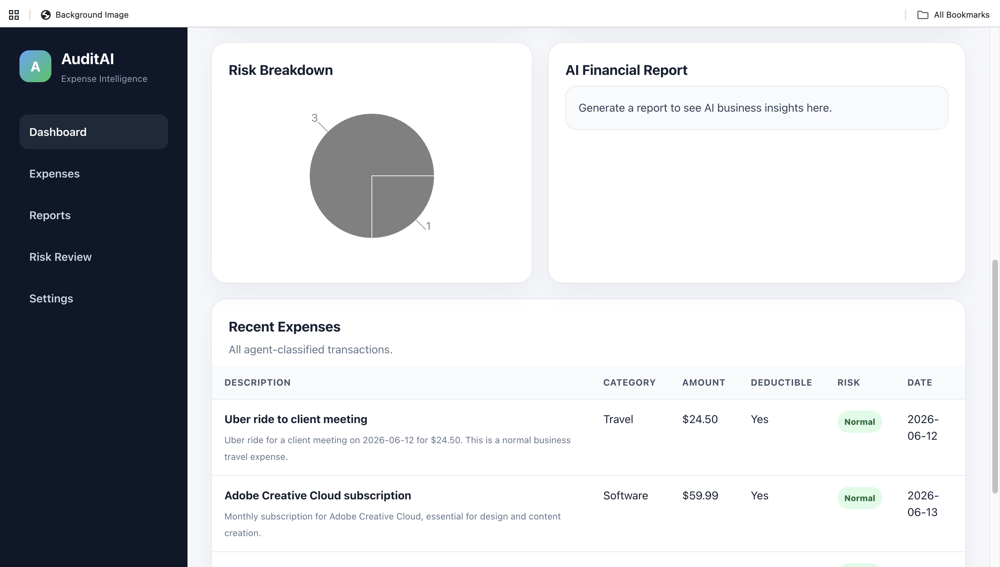

# AuditAI 

AI-powered expense intelligence platform that automatically categorizes business expenses, identifies potential risks, and generates financial reports using Large Language Models.

---

## Overview

AuditAI helps businesses organize expenses and gain insights from spending data through AI-powered analysis.

Instead of manually reviewing transactions, users can submit expenses and receive:

- Expense categorization
- Business purpose identification
- Tax deductibility recommendations
- Risk analysis
- AI-generated financial reporting

---

## Features

### AI Expense Analysis

Submit an expense and let AI determine:

- Category
- Business purpose
- Tax deductibility
- Risk level
- Summary

### Financial Dashboard

Track:

- Total spending
- Total expenses
- Review-required expenses
- Top spending categories
  
---

### Analytics & Visualizations

Visualize spending patterns with interactive charts.

Features include:

- Spending by category
- Risk breakdown
- Expense distribution

---

### AI Financial Reports

Generate business reports automatically.

Includes:

- Total spending
- Category breakdown
- Unusual expenses
- Business recommendations
- Executive summary
  
---

## Example Workflow

1. User submits an expense.
2. AuditAI sends the expense to an LLM through OpenRouter.
3. AI categorizes and analyzes the expense.
4. Expense is stored in the database.
5. Dashboard updates automatically.
6. Users can generate AI-powered business reports.

---

## Tech Stack

### Frontend

- React
- Vite
- Recharts

### Backend

- Node.js
- Express

### AI

- OpenRouter
- Gemini 2.5 Flash

### Storage

- JSON Persistence
- Future migration to PostgreSQL/MySQL

---

## System Architecture

```text
React Frontend
      │
      ▼
Express Backend API
      │
      ▼
OpenRouter AI Gateway
      │
      ▼
Gemini 2.5 Flash
      │
      ▼
Expense Analysis Engine
      │
      ▼
Data Storage
```

---

## Screenshots

### Dashboard



### Expense Analytics



---

## Installation

### Clone Repository

```bash
git clone https://github.com/Epson2/audit-ai.git
cd audit-ai
```

### Backend Setup

```bash
cd backend
npm install
```

Create a `.env` file:

```env
OPENROUTER_API_KEY=your_api_key_here
```

Run backend:

```bash
node server.js
```

Backend runs on:

```text
http://localhost:3001
```

---

### Frontend Setup

```bash
cd frontend
npm install
npm run dev
```

Frontend runs on:

```text
http://localhost:5173
```

---

## Future Improvements

- Receipt OCR
- PDF invoice uploads
- User authentication
- PostgreSQL database
- Multi-user organizations
- Budget forecasting
- Tax preparation assistance
- Scheduled financial reports
- Export to CSV/PDF

---

## Skills Demonstrated

- Full-Stack Development
- React Development
- REST API Design
- Node.js & Express
- AI Integration
- Prompt Engineering
- Data Visualization
- SaaS Dashboard Design
- Git & GitHub Workflow

---

## Why I Built This

I wanted to explore how AI can assist with real business workflows beyond simple chatbots.

AuditAI demonstrates how large language models can be integrated into a full-stack SaaS application to automate financial analysis, categorize expenses, identify potential risks, and provide business insights through a modern dashboard experience.

---

## License

MIT License
